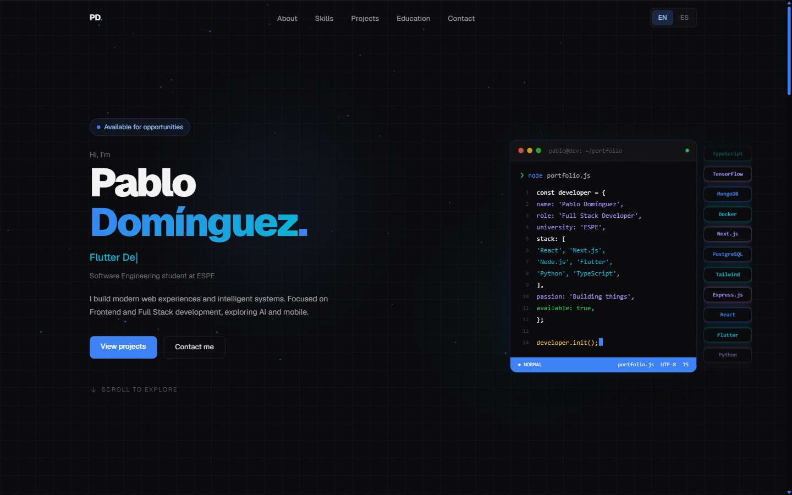

# Pablo Domínguez

**[🇺🇸 English](#user-content-english) · [🇪🇸 Español](#user-content-español)**

---

### 📊 GitHub Stats · Estadísticas

 

---

### 📈 Activity · Actividad

 

<picture>
  <source media="(prefers-color-scheme: dark)" srcset="assets/snake-dark.svg" />
  
</picture>

---

### 🖼️ Portfolio

**[Portfolio ↗](https://portfolio-ochre-xi-ba44zo6k9y.vercel.app/)**

---

🇺🇸 English · click to collapse/expand

### 👋 About me

Full Stack Developer specialized in React, TypeScript, and Node.js. I build complete web applications with a focus on clean architecture, secure authentication, automated testing, and deployment. Currently studying Software Engineering at ESPE (6th semester of 8) and looking for remote opportunities to contribute to impactful products.

- 🌎 Ecuador (GMT-5)
- 📫 pablodo004@gmail.com
- 🔗 [Portfolio](https://portfolio-ochre-xi-ba44zo6k9y.vercel.app/) · [LinkedIn](https://www.linkedin.com/in/pabl004-dev) · [ORCID](https://orcid.org/0009-0000-6400-026X)

---

### 💼 Experience

**Full Stack Developer (Freelance)** — Summer Dent · Roomify
End-to-end development: architecture, backend, frontend, authentication, and testing.

**Software Engineering Student** — ESPE, Ecuador · 2022 — present
Scholarship for Academic Distinction — top quintile of the cohort.

**Academic research**
Co-author of *"Comparative Study of BETO, CNN1D and BiLSTM for Automatic Cyberbullying Detection in Ecuadorian Spanish Social Media"* — submitted to [IEEE BigData 2026](https://bigdataieee.org/BigData2026/calls/papers/), under review (notification: Oct 24, 2026).

---

### 🛠️ Technologies

**Frontend:**      

**Backend:**      

**Data:**   

**Mobile:**     

**DevOps & testing:**     

---

### 🌐 Languages

**Spanish:** Native · **English:** B2 (Professional Working Proficiency)

---

### 🚀 Featured projects

<table>
<tr>
<td width="50%">

**[Eventual](https://github.com/Pa004/Eventual)**

Event management system built **solo**, end to end.
- 13/13 functional requirements implemented
- 137 tests, 100% pass rate (Jest/Supertest + bloc_test/mocktail)
- RBAC for 4 roles, complete financial module

`Node.js` `Express` `Flutter` `BLoC` `Supabase` `JWT`

</td>
<td width="50%">

**[futboltipster](https://github.com/Pa004/futboltipster)**

Statistical football predictions (1X2 and ~20 derived markets) using Dixon-Coles and Negative-Binomial models with confidence bands.
- Full-stack monorepo: FastAPI ml-service, Express server, React web

`TypeScript` `Python` `FastAPI` `React` `Express`

</td>
</tr>
<tr>
<td width="50%">

**[chatcito](https://github.com/Pa004/chatcito)**

Real-time chat with Flutter and Firebase.
- Secure authentication and private messaging
- Push notifications with FCM · Riverpod and Material 3

`Dart` `Flutter` `Firebase` `Riverpod`

</td>
<td width="50%">

**[e2e-APIs](https://github.com/Pa004/e2e-APIs)**

Automated API and UI end-to-end testing suite with Cypress and TypeScript.
- REST API testing · Page Object Model · custom commands
- HTML reporting with Mochawesome
- CI/CD with GitHub Actions

`TypeScript` `Cypress` `Mochawesome` `GitHub Actions`

</td>
</tr>
<tr>
<td width="50%">

**[Roomify](https://github.com/Pa004/roomify)**

AI platform that turns 2D floor plans into realistic 3D spaces.
- AI model integration (OpenAI API) as the core feature
- Social features: save, share, explore projects
- Containerized with Docker

`React 19` `TypeScript` `Tailwind CSS` `Docker` `Puter`

</td>
<td width="50%">

**[SecureAuth-MERN](https://github.com/Pa004/SecureAuth-MERN)**

Complete authentication system.
- JWT sessions · email verification
- Password recovery · protected routes

`MongoDB` `Express` `React` `Node.js`

</td>
</tr>
</table>

---

### 📜 Certifications

<table>
<tr>
<td width="50%" align="center">

**[🤖 AI Engineer for Developers Associate](https://www.datacamp.com/certificate/AIEDA0010543717785)**

OpenAI API · Embeddings · Semantic search · Conversational systems

*June 2026*

</td>
<td width="50%" align="center">

**[📊 Data Engineer Certificate](https://www.datacamp.com/certificate/DE0015585598056)**

Data pipelines · ETL · Data Warehousing · Data infrastructure

*June 2026*

</td>
</tr>
</table>

---

🇪🇸 Español · clic para expandir/colapsar

### 👋 Sobre mí

Full Stack Developer especializado en React, TypeScript y Node.js. Desarrollo aplicaciones web completas con énfasis en arquitectura limpia, autenticación segura, pruebas automatizadas y despliegue. Actualmente estudio Ingeniería en Software en la ESPE (6to semestre de 8) y busco oportunidades remotas para contribuir en productos de impacto.

- 🌎 Ecuador (GMT-5)
- 📫 pablodo004@gmail.com
- 🔗 [Portfolio](https://portfolio-ochre-xi-ba44zo6k9y.vercel.app/) · [LinkedIn](https://www.linkedin.com/in/pabl004-dev) · [ORCID](https://orcid.org/0009-0000-6400-026X)

---

### 💼 Experiencia

**Full Stack Developer (Freelance)** — Summer Dent · Roomify
Desarrollo end-to-end: arquitectura, backend, frontend, autenticación y testing.

**Estudiante de Ingeniería en Software** — ESPE, Ecuador · 2022 — presente
Beca por Distinción Académica — top quintil de la cohorte.

**Investigación académica**
Coautor de *"Comparative Study of BETO, CNN1D and BiLSTM for Automatic Cyberbullying Detection in Ecuadorian Spanish Social Media"* — enviado a [IEEE BigData 2026](https://bigdataieee.org/BigData2026/calls/papers/), en revisión (notificación: 24 oct. 2026).

---

### 🛠️ Tecnologías

**Frontend:**      

**Backend:**      

**Datos:**   

**Mobile:**     

**DevOps & testing:**     

---

### 🌐 Idiomas

**Español:** Nativo · **Inglés:** B2 (Professional Working Proficiency)

---

### 🚀 Proyectos destacados

<table>
<tr>
<td width="50%">

**[Eventual](https://github.com/Pa004/Eventual)**

Sistema de gestión de eventos construido **en solitario** de punta a punta.
- 13/13 requisitos funcionales implementados
- 137 tests, 100% pass rate (Jest/Supertest + bloc_test/mocktail)
- RBAC para 4 roles, módulo financiero completo

`Node.js` `Express` `Flutter` `BLoC` `Supabase` `JWT`

</td>
<td width="50%">

**[futboltipster](https://github.com/Pa004/futboltipster)**

Predicciones estadísticas de fútbol (1X2 y ~20 mercados derivados) con modelos Dixon-Coles y Negative-Binomial y bandas de confianza.
- Monorepo full-stack: ml-service FastAPI, servidor Express, web React

`TypeScript` `Python` `FastAPI` `React` `Express`

</td>
</tr>
<tr>
<td width="50%">

**[chatcito](https://github.com/Pa004/chatcito)**

Chat en tiempo real con Flutter y Firebase.
- Autenticación segura y mensajería privada
- Push notifications con FCM · Riverpod y Material 3

`Dart` `Flutter` `Firebase` `Riverpod`

</td>
<td width="50%">

**[e2e-APIs](https://github.com/Pa004/e2e-APIs)**

Suite de testing automatizado de APIs y UI end-to-end con Cypress y TypeScript.
- REST API testing · Page Object Model · custom commands
- Reporting HTML con Mochawesome
- CI/CD con GitHub Actions

`TypeScript` `Cypress` `Mochawesome` `GitHub Actions`

</td>
</tr>
<tr>
<td width="50%">

**[Roomify](https://github.com/Pa004/roomify)**

Plataforma de IA que transforma planos 2D en espacios 3D realistas.
- Integración de modelos de IA (OpenAI API) como feature central
- Funciones sociales: guardar, compartir, explorar proyectos
- Contenerizado con Docker

`React 19` `TypeScript` `Tailwind CSS` `Docker` `Puter`

</td>
<td width="50%">

**[SecureAuth-MERN](https://github.com/Pa004/SecureAuth-MERN)**

Sistema de autenticación completo.
- Sesiones JWT · verificación por email
- Recuperación de contraseña · rutas protegidas

`MongoDB` `Express` `React` `Node.js`

</td>
</tr>
</table>

---

### 📜 Certificaciones

<table>
<tr>
<td width="50%" align="center">

**[🤖 AI Engineer for Developers Associate](https://www.datacamp.com/certificate/AIEDA0010543717785)**

OpenAI API · Embeddings · Búsqueda semántica · Sistemas conversacionales

*Junio 2026*

</td>
<td width="50%" align="center">

**[📊 Data Engineer Certificate](https://www.datacamp.com/certificate/DE0015585598056)**

Pipelines de datos · ETL · Data Warehousing · Infraestructura de datos

*Junio 2026*

</td>
</tr>
</table>

