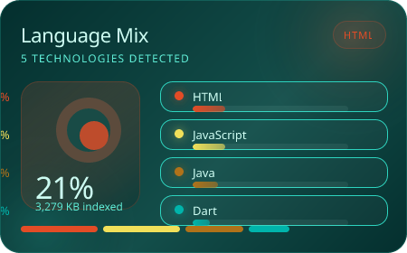
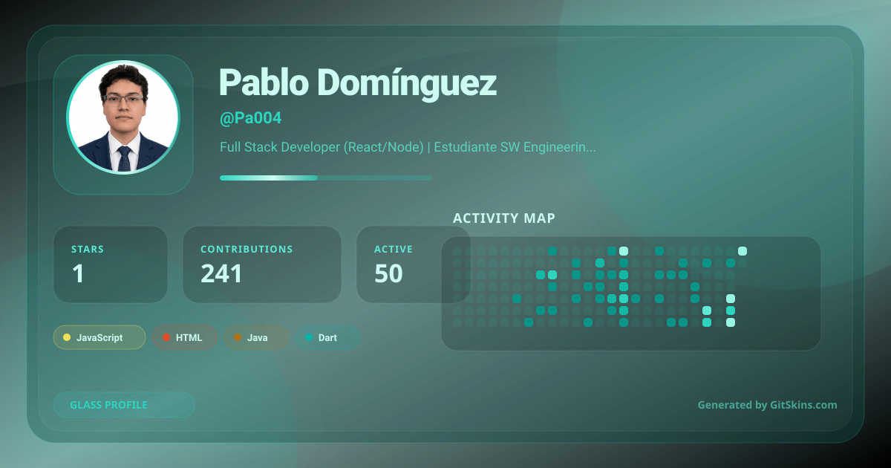
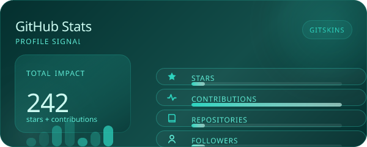
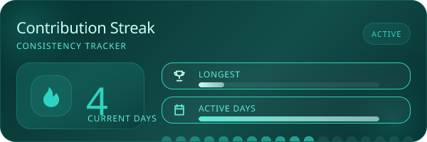

 

 

---

### 👋 Sobre mí

Full Stack Developer especializado en React, TypeScript y Node.js. Desarrollo aplicaciones web completas con énfasis en arquitectura limpia, autenticación segura, pruebas automatizadas y despliegue. Actualmente estudio Ingeniería en Software en la ESPE (6to semestre de 8) y busco oportunidades remotas para contribuir en productos de impacto.

- 🌎 Ecuador (GMT-5)
- 📫 pablodo004@gmail.com
- 🔗 [Portfolio](https://portfolio-ochre-xi-ba44zo6k9y.vercel.app/) · [LinkedIn](https://www.linkedin.com/in/pabl004-dev) · [ORCID](https://orcid.org/0009-0000-6400-026X)

---

### 💼 Experiencia

**Full Stack Developer (Freelance)** — Summer Dent · Roomify
Desarrollo end-to-end: arquitectura, backend, frontend, autenticación y testing.

**Estudiante de Ingeniería en Software** — ESPE, Ecuador · 2022 — presente
Beca por Distinción Académica — top quintil de la cohorte.

**Investigación académica**
Coautor de *"Comparative Study of BETO, CNN1D and BiLSTM for Automatic Cyberbullying Detection in Ecuadorian Spanish Social Media"* — enviado a [IEEE BigData 2026](https://bigdataieee.org/BigData2026/calls/papers/), en revisión (notificación: 24 oct. 2026).

---

### 🛠️ Tecnologías

**Frontend:** `React` `TypeScript` `JavaScript` `Next.js` `Tailwind CSS` `Vite`

**Backend:** `Node.js` `Express` `Python` `REST APIs` `JWT`

**Datos:** `MongoDB` `PostgreSQL` `Supabase`

**Mobile:** `Flutter` `Dart` `Clean Architecture` `BLoC`

**DevOps & testing:** `Docker` `Vercel` `Cypress` `Jest`

---

### 🌐 Idiomas

**Español:** Nativo · **Inglés:** B2 (Professional Working Proficiency)

---

### 🚀 Proyectos destacados

<table>
<tr>
<td width="50%">

**[Summer Dent](https://aplicacion-summer-dent.vercel.app/login)**

Sistema de gestión dental **en producción**, multi-sede.
- 90+ pacientes · 137+ citas gestionadas
- Autenticación JWT · roles por sede
- Testing E2E con Cypress

`React` `Vite` `Node.js` `Express` `JWT` `Cypress`

*Código privado.*

</td>
<td width="50%">

**[Roomify](https://github.com/Pa004/roomify)**

Plataforma de IA que transforma planos 2D en espacios 3D realistas.
- Integración de modelos de IA (OpenAI API) como feature central
- Funciones sociales: guardar, compartir, explorar proyectos
- Contenerizado con Docker

`React 19` `TypeScript` `Tailwind CSS` `Docker` `Puter`

</td>
</tr>
<tr>
<td width="50%">

**[Eventual](https://github.com/Pa004/Eventual)**

Sistema de gestión de eventos construido **en solitario** de punta a punta.
- 13/13 requisitos funcionales implementados
- 137 tests, 100% pass rate (Jest/Supertest + bloc_test/mocktail)
- RBAC para 4 roles, módulo financiero completo

`Node.js` `Express` `Flutter` `BLoC` `Supabase` `JWT`

</td>
<td width="50%">

**[SecureAuth-MERN](https://github.com/Pa004/SecureAuth-MERN)**

Sistema de autenticación completo.
- Sesiones JWT · verificación por email
- Recuperación de contraseña · rutas protegidas

`MongoDB` `Express` `React` `Node.js`

</td>
</tr>
<tr>
<td width="50%">

**[futboltipster](https://github.com/Pa004/futboltipster)**

Predicciones estadísticas de fútbol (1X2 y ~20 mercados derivados) con modelos Dixon-Coles y Negative-Binomial y bandas de confianza.
- Monorepo full-stack: ml-service FastAPI, servidor Express, web React

`TypeScript` `Python` `FastAPI` `React` `Express`

</td>
<td width="50%">

**[chatcito](https://github.com/Pa004/chatcito)**

Chat en tiempo real con Flutter y Firebase.
- Autenticación segura y mensajería privada
- Push notifications con FCM · Riverpod y Material 3

`Dart` `Flutter` `Firebase` `Riverpod`

</td>
</tr>
</table>

---

### 🖼️ Portfolio

**[Ver portfolio completo →](https://portfolio-ochre-xi-ba44zo6k9y.vercel.app/)**

---

### 📊 Estadísticas

 

---

### 📜 Certificaciones

<table>
<tr>
<td width="50%" align="center">

**[🤖 AI Engineer for Developers Associate](https://www.datacamp.com/certificate/AIEDA0010543717785)**

OpenAI API · Embeddings · Búsqueda semántica · Sistemas conversacionales

*Junio 2026*

</td>
<td width="50%" align="center">

**[📊 Data Engineer Certificate](https://www.datacamp.com/certificate/DE0015585598056)**

Pipelines de datos · ETL · Data Warehousing · Infraestructura de datos

*Junio 2026*

</td>
</tr>
</table>

---

### 📈 Contribuciones

